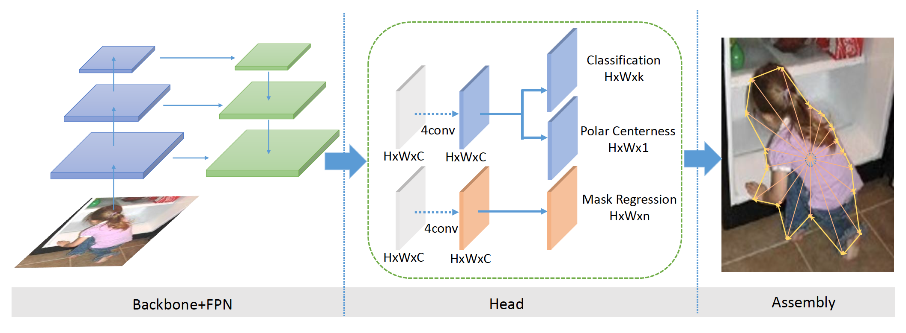
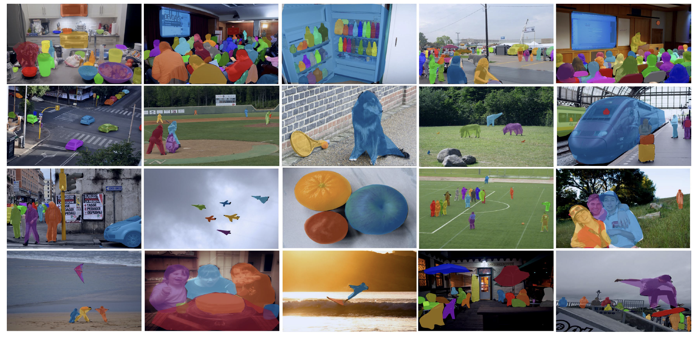
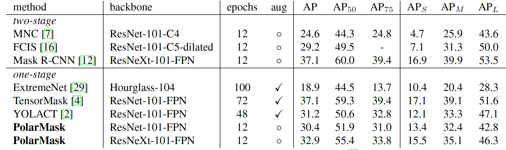

# PolarMask: Single Shot Instance Segmentation with Polar Representation

The code for implementing the **[PolarMask](https://arxiv.org/abs/1909.13226)**. 



## Highlights
- **Simple:** Anchor-free, single-stage and can be easily embeded to many detectors such as FCOS.
- **Unify:**  Our PolarMask first make object detection problem and instance segmentation problem into a unified dense regression problem.
- **Inference Fast:** Our PolarMask-R50 can achieve 29.1AP(800) / 23.9FPS, 27.6AP(600) / 34.1FPS, 22.9AP(400) / 46.7FPS on 1 V100 GPU.


## News
- New Fast DataLoader is updated. 4 V100 can train PolarMask in 15 hours.(2019.11.12)
- PolarMask-X101 with DCN, ms train and 2x can achieve 35.9 mAP. Code is released.(2019.10.26)
- PolarMask-X101 with DCN can achieve 34.9 mAP. Code is released.(2019.10.23)
- PolarMask-X101 with 2x and multi-scale train can achieve 33.5 mAP. Code and trained models with 2x and mstrain for R50,R101 and X101 are released.(2019.10.19)


## Performances





All the training time is measured on 32 Maxwell TitanX or 4 V100 GPUs, we found they achieve very similar performance.

All the inference speed is measured using converged models on 1 Maxwell TitanX / V100 GPU. We only report the model inference time.

Note that we found the V100 is nearly three times faster than TitanX. More details can refer to paper Table 1(f). 


## Results and Models
For 32 gpus, we set 2000 iters to warmup instead of 500. So the total epoches is 14 for 1x.
  
And the performance is similar to 4gpus. Most of experiments are run on 32gpus in paper to fasten the process.

The results are test on minival set.

Trained models can be download in [Google Drive](https://drive.google.com/drive/folders/1EWtLhWSGuJVtMCS8mTvKNxdYYpz7ufjV?usp=sharing).

| Backbone  | Style   | GN  | MS train | Lr schd |  GPUs | Inf time (fps) | mask AP 
|:---------:|:-------:|:----:|:-------:|:-------:|:-----:|:--------------:|:------:|
| R-50      | caffe   | Y    | N       | 1x      |  4    | 8.9/23.9       | 29.2   |
| R-101     | caffe   | Y    | N       | 1x      |  4    | -              | 30.7   | 
| X-101     | pytorch   | Y  | N       | 1x      |  4    | -              | 32.5   | 

| Backbone  | Style   | GN  | MS train | Lr schd |  GPUs | Inf time (fps) | mask AP|
|:---------:|:-------:|:----:|:-------:|:-------:|:-----:|:--------------:|:------:|
| R-50      | caffe   | Y    | N       | 1x      |  32    | 8.9/23.9      | 29.1   | 
| R-101     | caffe   | Y    | N       | 1x      |  32    | -             | 30.4   |
| X-101     | pytorch | Y    | N       | 1x      |  32    | -             | 32.6   | 
| R-50-DCN  | caffe   | Y    | N       | 1x      |  32    | -             | 32.0   | 
| R-101-DCN | caffe   | Y    | N       | 1x      |  32    | -             | 33.5   |
| X-101-DCN | pytorch | Y    | N       | 1x      |  32    | -             | 34.9   | 

Backbone  | Style   | GN  | MS train | Lr schd |  GPUs | Inf time (fps) | mask AP|
|:---------:|:-------:|:----:|:-------:|:-------:|:-----:|:--------------:|:------:|
| R-50      | caffe   | Y    | Y       | 2x      |  32    | 8.9/23.9      | 30.5   | 
| R-101     | caffe   | Y    | Y       | 2x      |  32    | -             | 31.9   |
| X-101     | pytorch | Y    | Y       | 2x      |  32    | -             | 33.5   |
| R-50-DCN  | caffe   | Y    | Y       | 2x      |  32    | -             | 33.3   | 
| R-101-DCN | caffe   | Y    | Y       | 2x      |  32    | -             | 34.3   |
| X-101-DCN | pytorch | Y    | Y       | 2x      |  32    | -             | 35.9   |  

**Notes:**
- The X-101 backbone is X-101-64x4d.
- Dataloader is rewrited and it is slow because generating labels for rays is complex. We will try to speed up it in the futher.


## Installation
Our PolarMask is based on [mmdetection](https://github.com/open-mmlab/mmdetection). Please check [INSTALL.md](INSTALL.md) for installation instructions.

## A quick Demo
Please run the ```demo/visualize.py```. Note that the ```size_diviser``` of test need to be set 32. 
Details can be found in [this issue](https://github.com/xieenze/PolarMask/issues/8#issuecomment-546577861).
Thanks [@zzzzzz0407](https://github.com/zzzzzz0407) for his useful advice.
## Training and Testing
**Train:**
##### 1. 4gpu train(same as FCOS)
- ```sh ./tools/dist_train.sh  configs/polarmask/4gpu/polar_768_1x_r50.py 4 --launcher pytorch --work_dir ./work_dirs/polar_768_1x_r50_4gpu```

##### 2. 32gpu train(for fasten)
- ```srun -p VI_ID_TITANX --job-name=PolarMask --gres=gpu:4 --ntasks=32 --ntasks-per-node=4 --kill-on-bad-exit=1 python -u tools/train.py configs/polarmask/32gpu/polar_768_1x_r50.py --launcher=slurm --work_dir ./work_dirs/polar_768_1x_r50_32gpu```


**Test:**
##### 4gpu test
- ```sh tools/dist_test.sh configs/polarmask/4gpu/polar_768_1x_r50.py ./work_dirs/polar_768_1x_r50_4gpu/latest.pth 4 --out work_dirs/trash/res.pkl --eval segm```


## Contributing to the project
Any pull requests or issues are welcome.

## Citations
Please consider citing our paper in your publications if the project helps your research. BibTeX reference is as follows.

```
@article{xie2019polarmask,
  title={PolarMask: Single Shot Instance Segmentation with Polar Representation},
  author={Xie, Enze and Sun, Peize and Song, Xiaoge and Wang, Wenhai and Liu, Xuebo and Liang, Ding and Shen, Chunhua and Luo, Ping},
  journal={arXiv preprint arXiv:1909.13226},
  year={2019}
}
```

## License

For academic use, this project is licensed under the 2-clause BSD License - see the LICENSE file for details. For commercial use, please contact the authors. 